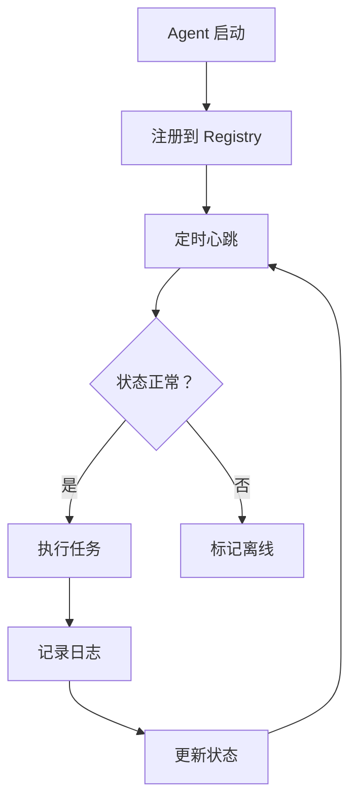
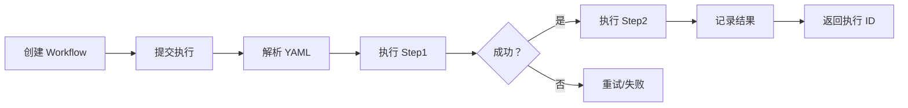

# Hunter 系统 Agent 管理模块 PRD

> 版本：v1.0  
> 作者：小宁（RAKkDm）  
> 日期：2026-04-16  
> 状态：草稿  
> 优先级：P0  
> 类型：AI 产品

---

## 1. 需求背景

### 1.1 业务背景

Hunter 系统是 OFW 信贷获客系统，需要管理多个 AI Agent 协同完成获客、风控、贷后等业务流程。当前缺乏统一的 Agent 管理平台，导致：

- Agent 分散管理，无法统一调度
- 缺乏状态监控，故障发现滞后
- 无法编排多 Agent 协同工作流
- 新 Agent 接入成本高

### 1.2 用户痛点

| 用户角色 | 痛点 | 影响 |
|:---------|:-----|:-----|
| **运营人员** | 无法实时查看 Agent 状态 | 故障发现滞后，影响业务 |
| **技术人员** | 新 Agent 接入流程复杂 | 开发成本高，周期长 |
| **产品经理** | 无法灵活编排业务流程 | 业务迭代慢，响应市场慢 |
| **管理层** | 缺乏 Agent 效能数据 | 无法优化资源配置 |

### 1.3 预期收益

| 收益维度 | 预期效果 | 衡量指标 |
|:---------|:---------|:---------|
| **效率提升** | Agent 接入时间从 3 天降至 1 小时 | 接入时长 |
| **稳定性** | 故障发现时间从小时级降至秒级 | MTTR |
| **业务灵活性** | 新业务流程编排从周级降至天级 | 上线周期 |
| **资源优化** | Agent 利用率提升 30% | 资源利用率 |

---

## 2. 需求描述

### 2.1 功能概述

构建统一的 Agent 管理平台，实现：
- Agent 注册与发现
- 状态监控与心跳检测
- 多 Agent 工作流编排
- 执行日志与效能分析

### 2.2 用户故事

| 编号 | 角色 | 行为 | 收益 | 优先级 |
|:-----|:-----|:-----|:-----|:------:|
| US001 | 技术人员 | 注册新 Agent | 快速接入系统 | P0 |
| US002 | 运营人员 | 查看 Agent 状态 | 实时监控健康度 | P0 |
| US003 | 产品经理 | 编排工作流 | 灵活配置业务流程 | P0 |
| US004 | 技术人员 | 查看执行日志 | 快速定位问题 | P1 |
| US005 | 管理层 | 查看效能报表 | 优化资源配置 | P2 |

### 2.3 功能详情

| 功能模块 | 功能点 | 描述 | 优先级 |
|:---------|:-------|:-----|:------:|
| **Agent 注册** | Agent 注册 | 支持 A2A/MCP/Local 三种类型 | P0 |
| **Agent 注册** | 配置管理 | 存储 Agent 连接配置 | P0 |
| **Agent 注册** | 元数据管理 | 记录 Agent 能力描述 | P1 |
| **状态监控** | 心跳检测 | 30 秒心跳，90 秒超时下线 | P0 |
| **状态监控** | 状态更新 | online/offline/busy | P0 |
| **状态监控** | 异常告警 | 状态异常时通知 | P1 |
| **工作流编排** | Workflow 定义 | YAML 配置工作流 | P0 |
| **工作流编排** | 执行引擎 | 顺序/条件/并行执行 | P0 |
| **工作流编排** | 变量传递 | 步骤间数据传递 | P0 |
| **执行管理** | 任务执行 | 异步执行工作流 | P0 |
| **执行管理** | 状态查询 | 查询执行进度 | P0 |
| **执行管理** | 日志记录 | 记录执行日志 | P1 |
| **数据看板** | Agent 统计 | 数量、类型、状态分布 | P2 |
| **数据看板** | 效能分析 | 调用量、成功率、耗时 | P2 |

---

## 3. 业务流程

### 3.1 核心流程



### 3.2 工作流执行流程



### 3.3 异常流程

| 异常场景 | 处理方式 | 用户提示 |
|:---------|:---------|:---------|
| Agent 注册失败 | 返回错误码 + 错误信息 | "Agent 注册失败：{原因}" |
| 心跳超时 | 自动标记 offline，触发告警 | 系统通知："Agent {name} 离线" |
| 工作流执行失败 | 记录失败步骤，支持重试 | "执行失败：步骤 {id} 失败" |
| Skill 不存在 | 返回错误，终止执行 | "Skill {name} 不存在" |

---

## 4. 功能规格（用户端）

### 4.1 页面设计

| 页面 | 元素 | 说明 |
|:-----|:-----|:-----|
| **Agent 列表页** | 搜索框、筛选器、Agent 卡片 | 支持按类型/状态筛选 |
| **Agent 详情页** | 基本信息、配置、状态历史 | 查看 Agent 详情 |
| **工作流列表页** | 工作流卡片、创建按钮 | 管理工作流 |
| **工作流编辑器** | YAML 编辑器、预览、保存 | 可视化编辑 |
| **执行记录页** | 执行列表、状态、日志 | 查看执行历史 |
| **数据看板** | 统计图表、趋势图 | 效能分析 |

### 4.2 交互说明

| 交互场景 | 触发条件 | 交互行为 | 结果 |
|:---------|:---------|:---------|:-----|
| 注册 Agent | 点击"注册 Agent"按钮 | 弹出表单，填写信息 | Agent 注册成功 |
| 查看状态 | 点击 Agent 卡片 | 刷新状态，显示详情 | 显示实时状态 |
| 创建工作流 | 点击"创建工作流" | 进入编辑器 | 保存 YAML 配置 |
| 执行工作流 | 点击"执行"按钮 | 异步执行，返回 execution_id | 可查询进度 |
| 查看日志 | 点击执行记录 | 展开日志详情 | 显示执行日志 |

### 4.3 数据规则

| 字段 | 类型 | 规则 | 示例 |
|:-----|:-----|:-----|:-----|
| agent_id | string | 唯一，UUID | "agent_001" |
| name | string | 必填，1-50 字符 | "weather-agent" |
| type | enum | a2a/mcp/local | "a2a" |
| config | JSON | 连接配置 | {"url": "..."} |
| status | enum | online/offline/busy | "online" |
| last_heartbeat | datetime | 自动更新 | "2026-04-16T10:00:00Z" |
| workflow_id | string | 唯一，UUID | "wf_001" |
| yaml_config | text | 有效 YAML | "name: ...\nsteps: ..." |

---

## 5. 功能规格（后台管理端）

### 5.1 管理页面

| 页面 | 功能 | 操作 | 说明 |
|:-----|:-----|:-----|:-----|
| **Agent 管理** | Agent 列表 | 增删改查、启用/禁用 | 管理所有 Agent |
| **Agent 配置** | 配置详情 | 查看/编辑配置 | 修改连接参数 |
| **工作流管理** | 工作流列表 | 增删改查、发布/下线 | 管理工作流 |
| **执行监控** | 执行记录 | 查看、重试、终止 | 监控执行情况 |
| **日志查询** | 日志列表 | 搜索、筛选、导出 | 问题排查 |
| **数据看板** | 统计报表 | 查看、导出 | 效能分析 |
| **系统配置** | 心跳间隔、超时时间 | 配置系统参数 | 全局配置 |

### 5.2 权限设计

| 角色 | 权限范围 | 可操作功能 |
|:-----|:---------|:-----------|
| **超级管理员** | 全部权限 | 所有功能 |
| **技术人员** | Agent 管理、工作流管理 | 注册 Agent、编辑工作流 |
| **运营人员** | 查看权限、执行权限 | 查看状态、执行工作流 |
| **管理层** | 查看权限 | 查看数据看板 |

### 5.3 配置管理

| 配置项 | 类型 | 默认值 | 说明 |
|:-------|:-----|:-------|:-----|
| heartbeat_interval | integer | 30 | 心跳间隔（秒） |
| heartbeat_timeout | integer | 90 | 超时下线时间（秒） |
| max_retry_count | integer | 3 | 最大重试次数 |
| log_retention_days | integer | 30 | 日志保留天数 |
| workflow_timeout | integer | 300 | 工作流超时时间（秒） |

### 5.4 数据管理

| 数据项 | 操作 | 规则 | 说明 |
|:-------|:-----|:-----|:-----|
| Agent 数据 | 增删改查 | 删除前检查关联工作流 | 核心数据 |
| 工作流数据 | 增删改查 | 删除前检查执行中任务 | 核心数据 |
| 执行记录 | 查询、删除 | 自动清理 30 天前数据 | 日志数据 |
| 系统日志 | 查询、导出 | 只读 | 审计日志 |

---

## 6. 数据埋点

| 事件名称 | 触发时机 | 参数 | 说明 |
|:---------|:---------|:-----|:-----|
| agent_registered | Agent 注册成功 | agent_id, type | 注册事件 |
| agent_heartbeat | Agent 心跳 | agent_id, status | 心跳事件 |
| agent_offline | Agent 离线 | agent_id, last_heartbeat | 离线事件 |
| workflow_created | 创建工作流 | workflow_id | 创建事件 |
| workflow_executed | 执行工作流 | workflow_id, execution_id | 执行事件 |
| workflow_completed | 工作流完成 | execution_id, status, duration | 完成事件 |
| workflow_failed | 工作流失败 | execution_id, failed_step, error | 失败事件 |
| page_view | 页面访问 | page_name, user_id | PV 统计 |

---

## 7. 验收标准

| 编号 | 验收项 | 验收标准 | 优先级 |
|:-----|:-------|:---------|:------:|
| AC001 | Agent 注册 | 可以成功注册 A2A/MCP/Local 三种类型 Agent | P0 |
| AC002 | Agent 列表 | 可以查询 Agent 列表，支持筛选 | P0 |
| AC003 | 心跳检测 | 30 秒心跳，90 秒超时自动下线 | P0 |
| AC004 | 工作流创建 | 可以创建 YAML 配置工作流 | P0 |
| AC005 | 工作流执行 | 可以执行工作流，返回 execution_id | P0 |
| AC006 | 状态查询 | 可以查询执行状态和进度 | P0 |
| AC007 | 变量传递 | 上一步输出可以传递给下一步 | P0 |
| AC008 | 条件分支 | 可以根据条件跳过步骤 | P1 |
| AC009 | 重试机制 | 失败步骤可以自动重试 | P1 |
| AC010 | 日志记录 | 记录完整执行日志 | P1 |
| AC011 | 权限控制 | 不同角色权限隔离 | P1 |
| AC012 | 数据看板 | 显示 Agent 统计和效能分析 | P2 |
| AC013 | 异常告警 | Agent 离线时发送告警通知 | P1 |
| AC014 | API 文档 | 完整的 OpenAPI 文档 | P1 |
| AC015 | 单元测试 | 覆盖率 >80% | P0 |

---

## A. AI 能力定义

### A.1 能力描述

本系统本身不直接使用 AI 模型，但为 AI Agent 提供管理和编排能力：
- 管理 LLM-based Agent（如对话 Agent、分析 Agent）
- 编排多 Agent 协同工作流
- 集成 A2A/MCP 协议的 AI 服务

### A.2 能力边界

| 能力范围 | 支持 | 不支持 |
|:---------|:-----|:-------|
| Agent 管理 | ✅ | - |
| 工作流编排 | ✅ | - |
| 状态监控 | ✅ | - |
| AI 模型调用 | ❌ | 由 Agent 自己实现 |
| Prompt 管理 | ❌ | 由 Agent 自己实现 |

### A.3 模型选型

本系统不直接使用 AI 模型，但支持集成以下类型的 Agent：

| Agent 类型 | 推荐模型 | 用途 |
|:----------|:---------|:-----|
| 对话 Agent | GPT-4o / Qwen | 用户交互 |
| 分析 Agent | GPT-4o / Claude | 数据分析 |
| 代码 Agent | Codex / StarCoder | 代码生成 |
| 视觉 Agent | GPT-4V / CLIP | 图像理解 |

---

## B. 集成规范

### B.1 A2A 协议集成

```yaml
Agent Card 格式:
  name: string
  description: string
  version: string
  capabilities:
    - name: string
      description: string
      endpoint: string
```

### B.2 MCP 协议集成

```yaml
JSON-RPC 2.0 格式:
  jsonrpc: "2.0"
  id: integer
  method: string
  params: object
```

### B.3 本地 Skill 集成

```python
# Python 函数格式
async def skill_name(**kwargs) -> Any:
    """Skill 描述"""
    pass
```

---

## C. 技术指标

| 指标 | 目标值 | 说明 |
|:-----|:------:|:-----|
| API 响应时间 | <100ms | P95 |
| 心跳检测延迟 | <5s | 从超时到标记离线 |
| 工作流执行延迟 | <500ms | 单步骤启动延迟 |
| 系统可用性 | >99.9% | 月度 |
| 并发支持 | >1000 | 同时执行工作流数 |

---

## D. 降级方案

| 触发条件 | 降级策略 | 用户提示 |
|:---------|:---------|:---------|
| 数据库不可用 | 切换到只读模式，缓存数据 | "系统维护中，稍后重试" |
| Agent 大规模离线 | 暂停新任务，告警通知 | 系统通知管理员 |
| 工作流执行超时 | 终止执行，记录日志 | "执行超时，已终止" |
| 日志存储满 | 自动清理旧日志 | 系统通知管理员 |

---

## E. 成本评估

本系统为基础设施，不直接使用 AI 模型，主要成本为：

| 项目 | 数值 | 说明 |
|:-----|:----:|:-----|
| 服务器成本 | $200/月 | 2 核 4G × 2 台 |
| 数据库成本 | $100/月 | PostgreSQL 托管 |
| 存储成本 | $50/月 | 日志存储 |
| **总计** | **$350/月** | - |

---

## F. 监控告警

| 监控指标 | 告警阈值 | 告警方式 |
|:---------|:---------|:---------|
| Agent 离线率 | >10% | 钉钉/邮件 |
| API 错误率 | >1% | 钉钉/邮件 |
| API 响应时间 | P95 >500ms | 钉钉 |
| 数据库连接数 | >80% | 钉钉/邮件 |
| 磁盘使用率 | >80% | 钉钉/邮件 |
| 工作流失败率 | >5% | 钉钉/邮件 |

---

## 8. 附录

### 8.1 相关文档

- [元智能体设计文档](meta_agent_design.md)
- [A2A MVP 总结](A2A_MVP_SUMMARY.md)
- [MCP 集成总结](MCP_INTEGRATION_SUMMARY.md)
- [Phase 2 总结](PHASE2_SUMMARY.md)
- [开发启动文档](HUNTER_AGENT_DEV_START.md)

### 8.2 技术栈

| 组件 | 技术选型 | 版本 |
|:-----|:---------|:-----|
| 后端框架 | FastAPI | 0.100+ |
| 数据库 | PostgreSQL / SQLite | 14+ |
| ORM | SQLAlchemy | 2.0+ |
| 异步 | asyncio | Python 3.10+ |
| 测试 | pytest | 7.0+ |
| 文档 | OpenAPI/Swagger | 3.0 |

### 8.3 项目结构

```
hunter_agent/
├── api/
│   ├── agents.py        # Agent 管理 API
│   ├── workflows.py     # 工作流管理 API
│   ├── executions.py    # 执行管理 API
│   └── schemas.py       # Pydantic 模型
├── core/
│   ├── registry.py      # Agent 注册中心
│   ├── heartbeat.py     # 心跳检测
│   └── workflow_engine.py  # 工作流引擎
├── models/
│   ├── agent.py         # Agent 模型
│   ├── workflow.py      # 工作流模型
│   └── execution.py     # 执行记录模型
├── db/
│   └── database.py      # 数据库连接
├── services/
│   ├── agent_service.py # Agent 业务逻辑
│   └── workflow_service.py  # 工作流业务逻辑
├── main.py              # FastAPI 入口
├── config.py            # 配置管理
└── tests/               # 单元测试
```

---

## 变更历史

| 版本 | 日期 | 变更内容 | 作者 |
|:-----|:-----|:---------|:-----|
| v1.0 | 2026-04-16 | 初始版本 | 小宁（RAKkDm） |

---

**文档版本：v1.0**  
**最后更新：2026-04-16**  
**创建者：小宁（RAKkDm）**  
**状态：草稿 - 待评审**
