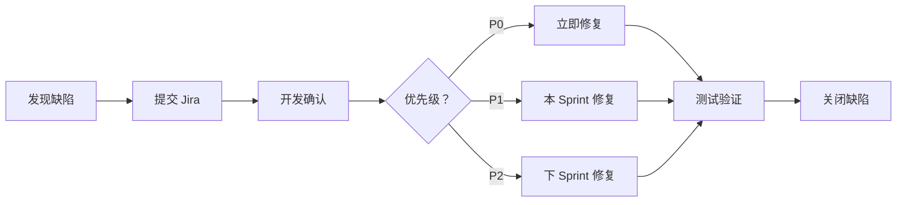
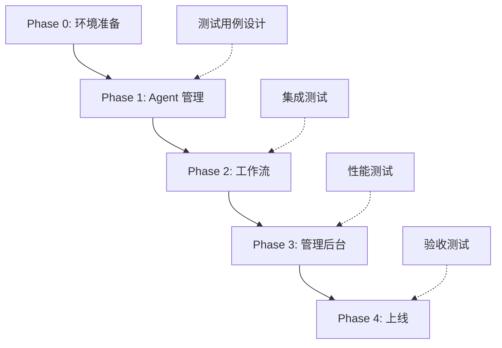

# Hunter 系统 Agent 管理模块 · 开发任务计划

> **版本：** v1.0  
> **作者：** 小宁（RAKkDm）  
> **日期：** 2026-04-16  
> **状态：** 待执行  
> **总工期：** 15 工作日（3 周）

---

## 一、任务总览

### 1.1 Phase 划分

| Phase | 名称 | 工期 | 优先级 | 负责人 | 状态 |
|:------|:-----|:-----|:------:|:-------|:-----|
| **Phase 0** | 环境准备 | 1 天 | ⭐⭐⭐ | 开发 | ⏳ 待开始 |
| **Phase 1** | Agent 新建与状态管理 | 5 天 | ⭐⭐⭐ | 开发 | ⏳ 待开始 |
| **Phase 2** | 工作流编排与执行 | 5 天 | ⭐⭐⭐ | 开发 | ⏳ 待开始 |
| **Phase 3** | 管理后台与数据看板 | 3 天 | ⭐⭐ | 开发 | ⏳ 待开始 |
| **Phase 4** | 集成测试与上线 | 1 天 | ⭐⭐⭐ | 测试 + 开发 | ⏳ 待开始 |

### 1.2 任务分解（WBS）

```
Hunter Agent 管理模块
├── Phase 0: 环境准备 (1 天)
│   ├── T0.1 项目初始化
│   ├── T0.2 数据库设计
│   └── T0.3 CI/CD配置
│
├── Phase 1: Agent 新建与状态管理 (5 天)
│   ├── T1.1 Agent 模型与数据库
│   ├── T1.2 Agent 新建 API
│   ├── T1.3 Agent 查询 API
│   ├── T1.4 心跳检测模块
│   └── T1.5 单元测试
│
├── Phase 2: 工作流编排与执行 (5 天)
│   ├── T2.1 Workflow 模型与数据库
│   ├── T2.2 Workflow 创建 API
│   ├── T2.3 Workflow 执行引擎
│   ├── T2.4 执行状态查询 API
│   └── T2.5 单元测试
│
├── Phase 3: 管理后台与数据看板 (3 天)
│   ├── T3.1 管理后台 API
│   ├── T3.2 数据看板 API
│   └── T3.3 权限控制
│
└── Phase 4: 集成测试与上线 (1 天)
    ├── T4.1 集成测试
    ├── T4.2 性能测试
    └── T4.3 上线部署
```

---

## 二、详细任务清单

### Phase 0: 环境准备（1 天）

| 任务 ID | 任务名称 | 描述 | 工时 | 依赖 | 验收标准 |
|:--------|:---------|:-----|:-----|:-----|:---------|
| **T0.1** | 项目初始化 | 创建项目结构、配置文件、依赖管理 | 4h | - | 项目可运行 |
| **T0.2** | 数据库设计 | 设计 agents/workflows/executions 表结构 | 2h | T0.1 | ER 图确认 |
| **T0.3** | CI/CD 配置 | GitHub Actions、Dockerfile、部署脚本 | 2h | T0.1 | CI 流水线跑通 |

**T0.1 详细任务：**
```bash
# 创建项目结构
mkdir -p hunter_agent/{api,core,models,db,services,tests}
touch hunter_agent/{main.py,config.py,__init__.py}
touch hunter_agent/api/{agents,workflows,executions,schemas}.py
touch hunter_agent/core/{registry,heartbeat,workflow_engine}.py
touch hunter_agent/models/{agent,workflow,execution}.py
touch hunter_agent/db/database.py
touch hunter_agent/services/{agent_service,workflow_service}.py

# 初始化依赖
pip install fastapi uvicorn sqlalchemy pydantic pytest
```

**T0.2 数据库设计：**
```sql
-- agents 表
CREATE TABLE agents (
    id VARCHAR(50) PRIMARY KEY,
    name VARCHAR(50) NOT NULL,
    type VARCHAR(20) NOT NULL, -- a2a/mcp/local
    config JSONB NOT NULL,
    metadata JSONB,
    status VARCHAR(20) DEFAULT 'offline', -- online/offline/busy
    last_heartbeat TIMESTAMP,
    created_at TIMESTAMP DEFAULT NOW(),
    updated_at TIMESTAMP DEFAULT NOW()
);

-- workflows 表
CREATE TABLE workflows (
    id VARCHAR(50) PRIMARY KEY,
    name VARCHAR(50) NOT NULL,
    description TEXT,
    yaml_config TEXT NOT NULL,
    status VARCHAR(20) DEFAULT 'draft', -- draft/published/archived
    created_at TIMESTAMP DEFAULT NOW(),
    updated_at TIMESTAMP DEFAULT NOW()
);

-- executions 表
CREATE TABLE executions (
    id VARCHAR(50) PRIMARY KEY,
    workflow_id VARCHAR(50) REFERENCES workflows(id),
    status VARCHAR(20) DEFAULT 'pending', -- pending/running/completed/failed
    input_data JSONB,
    output_data JSONB,
    started_at TIMESTAMP,
    completed_at TIMESTAMP,
    error_message TEXT,
    created_at TIMESTAMP DEFAULT NOW()
);

-- execution_logs 表
CREATE TABLE execution_logs (
    id SERIAL PRIMARY KEY,
    execution_id VARCHAR(50) REFERENCES executions(id),
    step_name VARCHAR(50),
    step_input JSONB,
    step_output JSONB,
    status VARCHAR(20),
    error_message TEXT,
    created_at TIMESTAMP DEFAULT NOW()
);
```

---

### Phase 1: Agent 新建与状态管理（5 天）

| 任务 ID | 任务名称 | 描述 | 工时 | 依赖 | 验收标准 |
|:--------|:---------|:-----|:-----|:-----|:---------|
| **T1.1** | Agent 模型与数据库 | SQLAlchemy 模型、数据库迁移 | 4h | Phase 0 | 模型可创建 |
| **T1.2** | Agent 新建 API | POST /agents，支持 A2A/MCP/Local | 6h | T1.1 | API 可注册 Agent |
| **T1.3** | Agent 查询 API | GET /agents, GET /agents/{id} | 4h | T1.1 | API 可查询 |
| **T1.4** | 心跳检测模块 | 30 秒心跳，90 秒超时下线 | 6h | T1.1 | 心跳正常工作 |
| **T1.5** | 单元测试 | 覆盖率>80% | 4h | T1.2-T1.4 | 测试通过 |

**T1.2 API 设计：**
```python
# POST /agents
Request:
{
    "name": "weather-agent",
    "type": "a2a",  # a2a/mcp/local
    "config": {
        "url": "http://agent-service:8000",
        "api_key": "xxx"
    },
    "metadata": {
        "description": "天气查询 Agent",
        "capabilities": ["weather_query"]
    }
}

Response:
{
    "agent_id": "agent_001",
    "status": "offline",
    "created_at": "2026-04-16T10:00:00Z"
}

# GET /agents
Query Params: type, status, page, page_size

Response:
{
    "total": 10,
    "agents": [...]
}

# GET /agents/{agent_id}
Response:
{
    "agent_id": "agent_001",
    "name": "weather-agent",
    "type": "a2a",
    "config": {...},
    "status": "online",
    "last_heartbeat": "2026-04-16T10:05:00Z"
}

# DELETE /agents/{agent_id}
Response:
{
    "success": true
}
```

**T1.4 心跳检测实现：**
```python
# 心跳检测逻辑
class HeartbeatMonitor:
    def __init__(self, interval=30, timeout=90):
        self.interval = interval  # 心跳间隔
        self.timeout = timeout    # 超时时间
    
    async def check_heartbeats(self):
        """定时检查心跳，标记离线 Agent"""
        while True:
            await asyncio.sleep(self.interval)
            agents = await self.get_all_agents()
            for agent in agents:
                if self.is_offline(agent):
                    await self.mark_offline(agent.id)
    
    def is_offline(self, agent):
        """判断是否超时"""
        if not agent.last_heartbeat:
            return True
        elapsed = datetime.now() - agent.last_heartbeat
        return elapsed.total_seconds() > self.timeout
```

---

### Phase 2: 工作流编排与执行（5 天）

| 任务 ID | 任务名称 | 描述 | 工时 | 依赖 | 验收标准 |
|:--------|:---------|:-----|:-----|:-----|:---------|
| **T2.1** | Workflow 模型与数据库 | SQLAlchemy 模型、数据库迁移 | 4h | Phase 0 | 模型可创建 |
| **T2.2** | Workflow 创建 API | POST /workflows，YAML 配置 | 6h | T2.1 | API 可创建工作流 |
| **T2.3** | Workflow 执行引擎 | 解析 YAML、调用 Agent、变量传递 | 8h | T2.1, Phase1 | 工作流可执行 |
| **T2.4** | 执行状态查询 API | GET /executions/{id}/status | 4h | T2.3 | 可查询进度 |
| **T2.5** | 单元测试 | 覆盖率>80% | 4h | T2.2-T2.4 | 测试通过 |

**T2.2 API 设计：**
```python
# POST /workflows
Request:
{
    "name": "获客流程",
    "description": "FB 社群监控 → 意图识别 → 申请引导",
    "yaml_config": """
name: 获客流程
version: 1.0
steps:
  - id: step1
    agent: fb-monitor-agent
    action: monitor
    output: posts
  - id: step2
    agent: intent-agent
    action: classify
    input: ${step1.output.posts}
    output: intents
  - id: step3
    agent: application-agent
    action: guide
    input: ${step2.output.intents}
"""
}

Response:
{
    "workflow_id": "wf_001",
    "status": "draft"
}

# POST /workflows/{workflow_id}/execute
Request:
{
    "input_data": {
        "keyword": "loan"
    }
}

Response:
{
    "execution_id": "exec_001",
    "status": "running"
}

# GET /executions/{execution_id}/status
Response:
{
    "execution_id": "exec_001",
    "workflow_id": "wf_001",
    "status": "running",  # pending/running/completed/failed
    "current_step": "step2",
    "progress": 66,
    "output_data": {...}
}
```

**T2.3 执行引擎核心逻辑：**
```python
class WorkflowEngine:
    async def execute(self, workflow_id: str, input_data: dict):
        """执行工作流"""
        workflow = await self.get_workflow(workflow_id)
        execution = await self.create_execution(workflow_id, input_data)
        
        # 异步执行
        asyncio.create_task(self._run_steps(execution, workflow))
        
        return execution
    
    async def _run_steps(self, execution, workflow):
        """按步骤执行"""
        yaml_config = yaml.safe_load(workflow.yaml_config)
        context = {"input": input_data}
        
        for step in yaml_config["steps"]:
            # 更新状态
            await self.update_step_status(execution.id, step["id"], "running")
            
            # 解析输入变量
            step_input = self.resolve_variables(step.get("input"), context)
            
            # 调用 Agent
            agent = await self.get_agent(step["agent"])
            result = await self.call_agent(agent, step["action"], step_input)
            
            # 保存输出
            context[step["output"]] = result
            await self.log_step(execution.id, step["id"], result)
            
            # 条件判断
            if step.get("condition") and not self.evaluate(step["condition"], context):
                continue
        
        # 完成
        await self.complete_execution(execution.id, context)
```

---

### Phase 3: 管理后台与数据看板（3 天）

| 任务 ID | 任务名称 | 描述 | 工时 | 依赖 | 验收标准 |
|:--------|:---------|:-----|:-----|:-----|:---------|
| **T3.1** | 管理后台 API | Agent 管理、工作流管理、执行监控 | 8h | Phase1-2 | API 可用 |
| **T3.2** | 数据看板 API | 统计查询、效能分析 | 4h | Phase1-2 | 数据准确 |
| **T3.3** | 权限控制 | RBAC 权限模型 | 4h | T3.1 | 权限隔离 |

**T3.1 管理 API：**
```python
# Agent 管理
PATCH /agents/{id}/enable   # 启用
PATCH /agents/{id}/disable  # 禁用
PUT /agents/{id}/config     # 更新配置

# Workflow 管理
PATCH /workflows/{id}/publish   # 发布
PATCH /workflows/{id}/archive   # 归档
PUT /workflows/{id}/config      # 更新配置

# 执行监控
POST /executions/{id}/retry     # 重试
POST /executions/{id}/cancel    # 取消
GET /executions/{id}/logs       # 查询日志
```

**T3.2 数据看板 API：**
```python
# GET /dashboard/stats
Response:
{
    "agents": {
        "total": 15,
        "online": 12,
        "offline": 3,
        "by_type": {"a2a": 8, "mcp": 5, "local": 2}
    },
    "workflows": {
        "total": 20,
        "published": 15,
        "draft": 5
    },
    "executions": {
        "today": 150,
        "success_rate": 95.5,
        "avg_duration": 2.3  # 秒
    }
}

# GET /dashboard/trends?days=7
Response:
{
    "executions_trend": [
        {"date": "2026-04-10", "count": 120},
        {"date": "2026-04-11", "count": 135},
        ...
    ],
    "success_rate_trend": [...]
}
```

**T3.3 权限模型：**
```python
# RBAC 权限设计
roles = {
    "admin": ["*"],  # 全部权限
    "developer": ["agents:*", "workflows:*", "executions:read"],
    "operator": ["agents:read", "workflows:read", "executions:*"],
    "viewer": ["agents:read", "workflows:read", "executions:read", "dashboard:read"]
}

# 权限装饰器
@require_permission("agents:create")
async def create_agent(...):
    pass
```

---

### Phase 4: 集成测试与上线（1 天）

| 任务 ID | 任务名称 | 描述 | 工时 | 依赖 | 验收标准 |
|:--------|:---------|:-----|:-----|:-----|:---------|
| **T4.1** | 集成测试 | 端到端测试、场景测试 | 4h | Phase1-3 | 核心流程通过 |
| **T4.2** | 性能测试 | 压力测试、并发测试 | 2h | T4.1 | 性能达标 |
| **T4.3** | 上线部署 | 生产环境部署、监控配置 | 2h | T4.1-T4.2 | 服务可用 |

**T4.1 集成测试场景：**
```python
# 场景 1: Agent 注册 → 心跳 → 查询 → 删除
async def test_agent_lifecycle():
    agent = await create_agent(...)
    assert agent.status == "offline"
    
    await send_heartbeat(agent.id)
    agent = await get_agent(agent.id)
    assert agent.status == "online"
    
    await delete_agent(agent.id)
    assert await get_agent(agent.id) is None

# 场景 2: 工作流创建 → 执行 → 查询 → 完成
async def test_workflow_execution():
    workflow = await create_workflow(...)
    execution = await execute_workflow(workflow.id, input_data)
    
    # 轮询状态
    for _ in range(10):
        status = await get_execution_status(execution.id)
        if status == "completed":
            break
        await asyncio.sleep(1)
    
    assert status == "completed"

# 场景 3: 多 Agent 协同
async def test_multi_agent_collaboration():
    # 创建 3 个 Agent
    agent1 = await create_agent(type="a2a")
    agent2 = await create_agent(type="mcp")
    agent3 = await create_agent(type="local")
    
    # 创建工作流，串联 3 个 Agent
    workflow = await create_workflow(yaml=...)
    
    # 执行并验证
    execution = await execute_workflow(workflow.id)
    assert execution.status == "completed"
```

**T4.2 性能测试指标：**
```yaml
性能目标:
  API 响应时间:
    P50: <50ms
    P95: <100ms
    P99: <200ms
  
  并发能力:
    同时执行工作流: >1000
    心跳请求: >5000/s
  
  资源使用:
    CPU: <70%
    内存: <2GB
    数据库连接: <100

压测场景:
  - 场景 1: 1000 并发 Agent 注册
  - 场景 2: 500 并发工作流执行
  - 场景 3: 5000/s心跳请求
```

---

## 三、测试人员接入计划

### 3.1 测试角色与职责

| 角色 | 职责 | 介入阶段 | 工时 |
|:-----|:-----|:---------|:-----|
| **测试工程师** | 测试用例设计、执行测试、缺陷跟踪 | Phase 1-4 | 8 天 |
| **开发工程师** | 单元测试、修复缺陷 | Phase 1-4 | 15 天 |
| **产品经理** | 验收测试、业务验证 | Phase 3-4 | 2 天 |

### 3.2 测试介入时间点

```
Phase 0 (环境准备)
    ↓
Phase 1 (Agent 管理) ──→ 测试介入：评审测试用例
    ↓                        ↓
Phase 2 (工作流) ─────→ 测试介入：执行测试
    ↓                        ↓
Phase 3 (管理后台) ────→ 测试介入：集成测试
    ↓                        ↓
Phase 4 (上线) ────────→ 测试介入：验收测试
```

### 3.3 测试交付物

| 交付物 | 负责人 | 完成时间 |
|:-------|:-------|:---------|
| 测试用例文档 | 测试工程师 | Phase 1 结束 |
| 单元测试报告 | 开发工程师 | 每个 Phase 结束 |
| 集成测试报告 | 测试工程师 | Phase 3 结束 |
| 性能测试报告 | 测试工程师 | Phase 4 结束 |
| 验收测试报告 | 产品经理 | Phase 4 结束 |

### 3.4 缺陷管理流程



### 3.5 测试环境配置

| 环境 | 用途 | 负责人 | 配置 |
|:-----|:-----|:-------|:-----|
| **开发环境** | 开发自测 | 开发 | 本地 Docker |
| **测试环境** | 集成测试 | 测试 | 独立服务器 |
| **预发布环境** | 验收测试 | 产品 + 测试 | 生产镜像 |
| **生产环境** | 线上服务 | 运维 | Kubernetes |

---

## 四、风险与应对

| 风险 | 概率 | 影响 | 应对措施 |
|:-----|:----:|:----:|:---------|
| **A2A 协议不稳定** | 中 | 高 | 预留 MCP/Local 备选方案 |
| **工作流引擎性能瓶颈** | 中 | 高 | 提前压测，优化异步执行 |
| **心跳检测精度问题** | 低 | 中 | 增加容错机制，多次确认 |
| **测试人力不足** | 中 | 中 | 开发兼任测试，自动化优先 |
| **需求变更** | 高 | 中 | 敏捷迭代，小步快跑 |

---

## 五、里程碑

| 里程碑 | 时间 | 交付物 | 验收人 |
|:-------|:-----|:-------|:-------|
| **M1: Phase 1 完成** | Day 6 | Agent 管理 API + 单元测试 | Diwei |
| **M2: Phase 2 完成** | Day 11 | 工作流引擎 + 集成测试 | Diwei |
| **M3: Phase 3 完成** | Day 14 | 管理后台 + 数据看板 | Diwei |
| **M4: 上线发布** | Day 15 | 生产环境 + 监控 | Diwei |

---

## 六、资源需求

### 6.1 人力资源

| 角色 | 人数 | 工时 | 阶段 |
|:-----|:----:|:-----|:-----|
| 后端开发 | 1-2 | 15 天 | Phase 1-4 |
| 测试工程师 | 1 | 8 天 | Phase 1-4 |
| 产品经理 | 0.5 | 2 天 | Phase 3-4 |
| 运维 | 0.5 | 1 天 | Phase 4 |

### 6.2 硬件资源

| 资源 | 规格 | 数量 | 用途 |
|:-----|:-----|:----:|:-----|
| 服务器 | 2 核 4G | 2 台 | 应用服务 |
| 数据库 | PostgreSQL | 1 个 | 数据存储 |
| 测试环境 | 1 核 2G | 1 台 | 集成测试 |

### 6.3 软件资源

| 软件 | 用途 | 成本 |
|:-----|:-----|:-----|
| GitHub | 代码托管 | 免费 |
| Jira | 缺陷管理 | $10/月 |
| PostgreSQL | 数据库 | 免费 |
| Docker | 容器化 | 免费 |

---

## 七、沟通机制

### 7.1 日常沟通

| 形式 | 频率 | 参与人 | 内容 |
|:-----|:-----|:-------|:-----|
| 站会 | 每日 10:00 | 开发 + 测试 | 进度同步、问题暴露 |
| 周会 | 每周一 14:00 | 全员 | 周计划、风险同步 |
| 评审会 | 每 Phase 结束 | 开发 + 产品 | 代码评审、验收 |

### 7.2 沟通渠道

| 渠道 | 用途 | 响应时间 |
|:-----|:-----|:---------|
| 钉钉群 | 日常沟通 | 即时 |
| 邮件 | 正式通知 | 24h |
| Jira | 缺陷跟踪 | 48h |
| 文档 | 知识沉淀 | - |

---

## 八、附录

### 8.1 任务检查清单

**Phase 1 检查清单：**
- [ ] 数据库表创建
- [ ] Agent 模型实现
- [ ] 新建 API 实现
- [ ] 查询 API 实现
- [ ] 心跳检测实现
- [ ] 单元测试编写
- [ ] 测试覆盖率>80%
- [ ] API 文档完善

**Phase 2 检查清单：**
- [ ] Workflow 模型实现
- [ ] 创建 API 实现
- [ ] 执行引擎实现
- [ ] 状态查询 API 实现
- [ ] 单元测试编写
- [ ] 测试覆盖率>80%
- [ ] API 文档完善

**Phase 3 检查清单：**
- [ ] 管理 API 实现
- [ ] 数据看板 API 实现
- [ ] 权限控制实现
- [ ] 集成测试通过
- [ ] API 文档完善

**Phase 4 检查清单：**
- [ ] 集成测试完成
- [ ] 性能测试完成
- [ ] 部署脚本准备
- [ ] 监控告警配置
- [ ] 上线文档完善

### 8.2 依赖关系图



---

**文档版本：v1.0**  
**创建时间：2026-04-16**  
**创建者：小宁（RAKkDm）**  
**状态：待执行**
